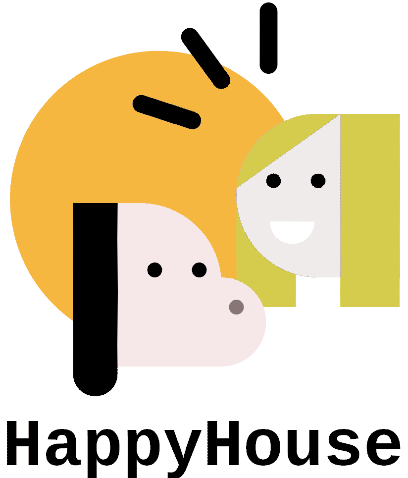
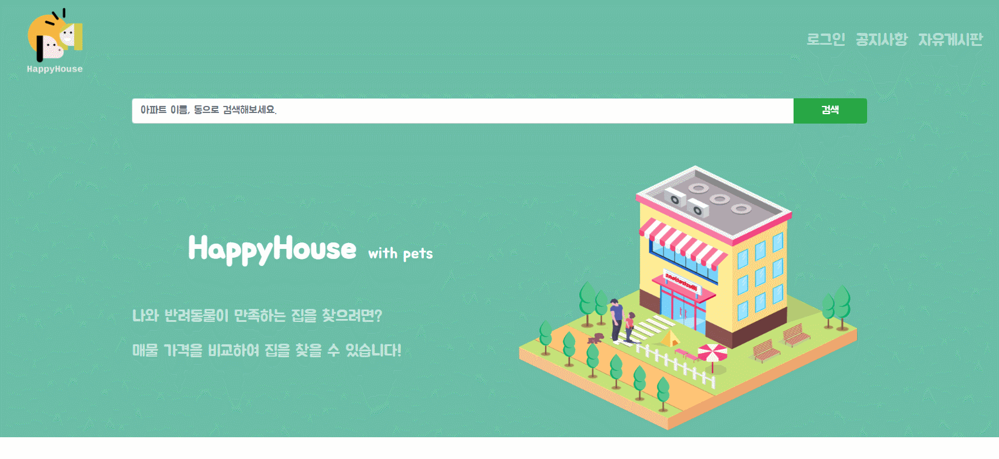
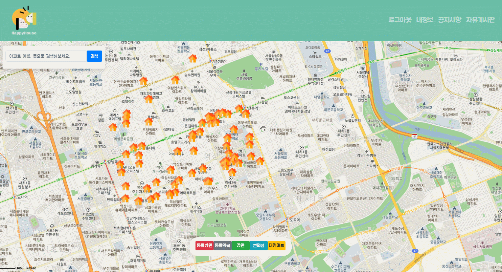
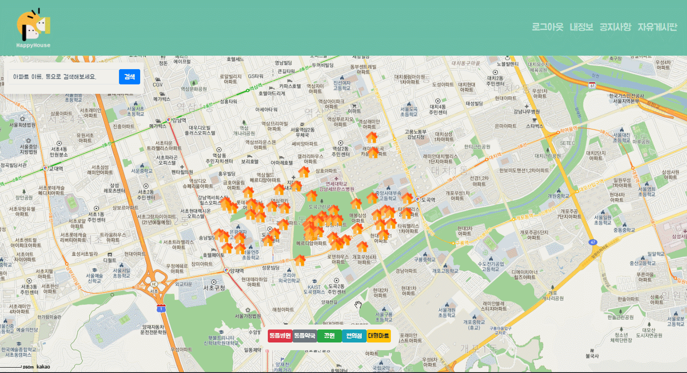
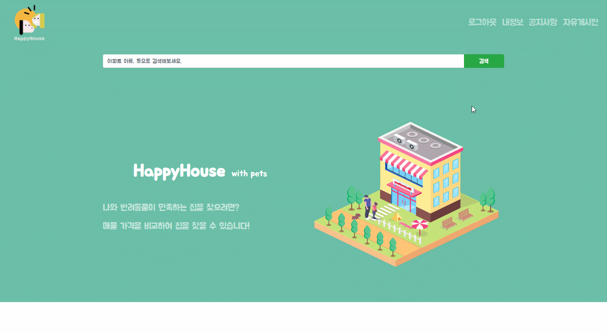
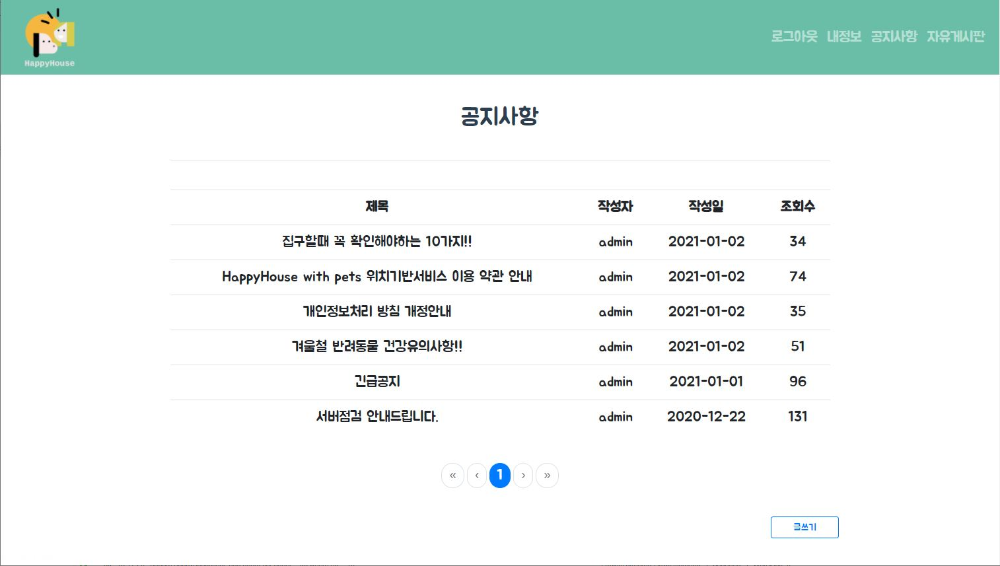

</img>

 

# HappyHouse_with_Pets

## 목차

1. [프로젝트 소개](#1프로젝트-소개)

2. [개발 도구 및 환경](#2개발-도구-및-환경)

3. [설치](#3설치)

4. [실행](#4실행)

5. [기능](#5기능)

6. [페이지](#6페이지)

## 1.프로젝트 소개
- **HappyHouse_with_Pets** 프로젝트는 반려동물 양육가구를 타깃으로 한 부동산 웹 어플리케이션입니다.
- **기간**: 2020.11.23 ~ 2020.12.07
- **팀원**: 엄재웅 [@eomjaewoong](https://github.com/eomjaewoong)
- **목표기능**
  - 서울 시내 주택 정보 조회
  - 주택의 거래 정보 조회
  - 주택 리뷰와 별점 기능
  - 주택 주변의 반려동물 시설과 편의 시설 조회
  - 게시판과 댓글 기능
  

## 2.개발 도구 및 환경

- Spring Boot
- Maven
- MyBatis
- Vue.js
- Node.js
- Vue Bootstrap
- Axios
- MySQL
- Kakao Map Api
- Java8 (zulu open jdk)
- AWS EC2,RDS,S3

## 3.설치

happyhouse_client는 frontend(Vue.js), happyhouse_server는 backend(Spring Boot)을 포함하고 있으며 client와 server는 REST API 방식으로 통신합니다.

## 4.실행
### AWS 웹 호스팅(pc환경을 권장합니다.)
http://happyhouse-with-pets.s3-website.ap-northeast-2.amazonaws.com/

## 5.기능 
- 회원
  - 회원가입
  - 회원정보 수정
  - 회원 탈퇴
  - 로그인/로그아웃
- 검색
  - 주택검색
  - 주택거래정보 조회
  - 검색어 자동완성 기능
  - 최근 검색어 조회
  - 리뷰/별점
  - 반려동물시설(동물약국, 동물병원, 공원) 조회
  - 편의시설(편의점, 대형마트) 조회
- 게시판
  - 게시글 조회/작성/수정/삭제
  - 댓글 조회/작성/수정/삭제
- 공지사항
  - 관리자만 작성/수정/삭제
  - 댓글 조회/작성/수정/삭제

## 6.페이지

- 회원가입 
  </img>
- 로그인/로그아웃 
  </img>
- 회원정보 수정/삭제 
  </img>
- 주택검색/주택거래정보 조회 
  </img>
- 리뷰/별점 
  </img>
- 추가정보 조회 
  </img>
- 게시판CRUD 
  </img>
- 댓글 
  </img>
- 공지사항 
  </img>
