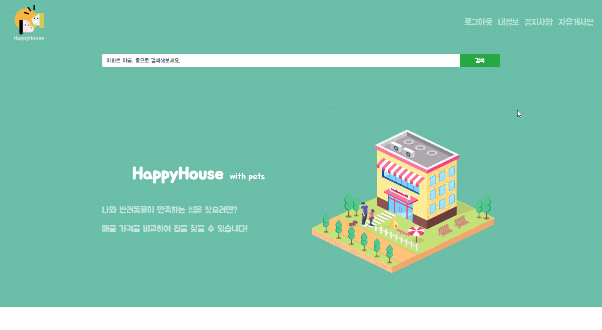

</img>


<br/>

# HappyHouse_with_pets

## 목차

1. [프로젝트 소개](##-1.프로젝트-소개)

2. [개발 도구 및 환경](##-2.개발-도구-및-환경)

3. [설치](##-3.설치)

4. [실행](##-4.실행)

5. [기능](##-5.기능)

## 1.프로젝트 소개

**HappyHouse_with_pets** 프로젝트는 반려동물 양육가구 주 타깃으로 한 부동산 웹 어플리케이션입니다. 서울 시내의 주택 정보와 실거래가를 검색할 수 있습니다. 동물병원, 동물약국, 공원 정보를 제공하여 반려 동물를 양육하는 가구에 도움이 될 수 있습니다. 또한 편의점과 대형마트 정보를 제공하는 등 주변 편의시설에 대한 정보를 제공합니다. 주택 평점과 리뷰기능을 통해 실 거주자의 의견을 얻을 수 있고 자유게시판을 통해 다른 사용자와 반려동물과 주택, 동네 정보를 공유할 수 있습니다.

## 2.개발 도구 및 환경

- Spring boot
- Maven
- Vue.js
- Node.js
- Vue Bootstrap
- axios
- MyBatis
- MySQL
- Kakao Map Api
- Java8 (zulu open jdk)

## 3.설치

happyhouse_client는 frontend(Vue.js), happyhouse_server는 backend(Spring Boot)을 포함하고 있습니다.

## 4.실행
### AWS 웹 호스팅(pc환경을 권장합니다.)
http://happyhouse-with-pets.s3-website.ap-northeast-2.amazonaws.com/

## 5.기능

- 회원가입<br/>
  </img>
- 로그인/로그아웃<br/>
  </img>
- 회원정보 수정/삭제<br/>
  </img>
- 주택검색/주택거래정보 조회<br/>
  </img>
- 리뷰<br/>
  </img>
- 추가정보(동물병원/동물약국/공원/편의점/대형마트)<br/>
  </img>
- 게시판<br/>
  </img>
- 댓글<br/>
  </img>
- 공지사항<br/>
  </img>

<!-- ### Compiles and hot-reloads for development
```
npm run serve
```

### Compiles and minifies for production
```
npm run build
```

### Lints and fixes files
```
npm run lint
```

### Customize configuration
See [Configuration Reference](https://cli.vuejs.org/config/). -->
